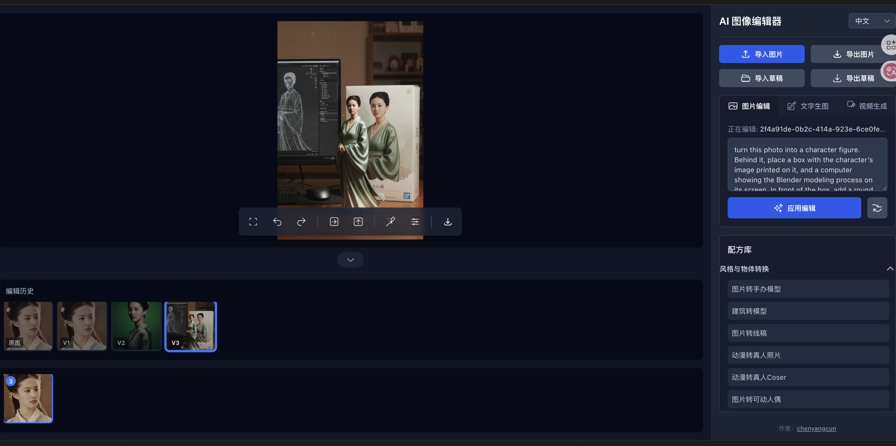

一款由 Gemini (Nano Banana) 驱动的 AI 创意画布，用提示词魔法批量处理您的图片。

功能列表
1. 选择图片，根据预置的提示词进行图片生成
2. 根据文字描述，生成图片
3. 针对已经编辑过的图片，可以继续用其他提示词链式编辑
4. 支持参考其他图片+提示词，对主图片进行编辑
5. 支持编辑草稿的导出和导入，方便后续继续创作
6. 支持图片的简单编辑：比如剪切，旋转等
7. 支持根据图片和提示词生成视频

# AI Studio中运行

AI Studio演示地址: https://ai.studio/apps/drive/1I8vIZhBkAZs9mzhRb7aPeXhAEJ09EX9o

## 本地运行

**Prerequisites:**  Node.js

1. Install dependencies:
   `npm install`
2. Set the `GEMINI_API_KEY` in [.env.local](.env.local) to your Gemini API key
3. Run the app:
   `npm run dev`
